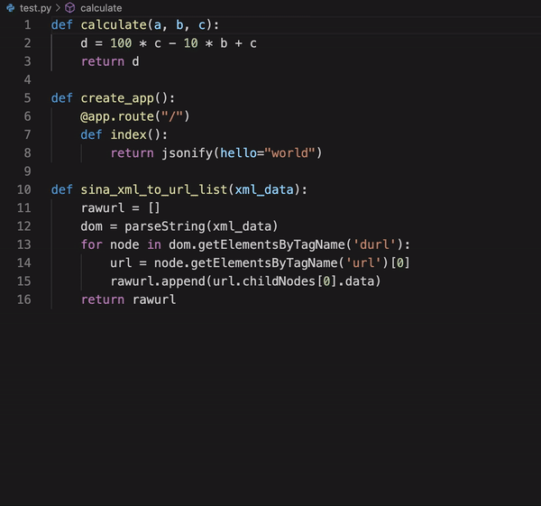

[](https://travis-ci.org/NilsJPWerner/autoDocstring)
[](https://marketplace.visualstudio.com/items?itemName=njpwerner.autodocstring)
[](https://marketplace.visualstudio.com/items?itemName=njpwerner.autodocstring&ssr=false#review-details)

# VSCode Python Docstring Generator

Visual Studio Code extension to quickly generate docstrings for python functions.



## Features

-   Quickly generate a docstring snippet that can be tabbed through.
-   Choose between several different types of docstring formats.
-   Infers parameter types through pep484 type hints, default values, and var names.
-   Support for args, kwargs, decorators, errors, and parameter types

## Docstring Formats

-   Google (default)
-   docBlockr
-   Numpy
-   Sphinx
-   PEP0257 (coming soon)

## Usage

Cursor must be on the line directly below the definition to generate full auto-populated docstring

-   Press enter after opening docstring with triple quotes (`"""` or `'''`)
-   Keyboard shortcut: `ctrl+shift+2` or `cmd+shift+2` for mac
    -   Can be changed in Preferences -> Keyboard Shortcuts -> extension.generateDocstring
-   Command: `Generate Docstring`
-   Right click menu: `Generate Docstring`

## Extension Settings

This extension contributes the following settings:

-   `autoDocstring.docstringFormat`: Switch between different docstring formats
-   `autoDocstring.ServerEndpoint`: endpoint address accessible to the server
-   `autoDocstring.customTemplatePath`: Path to a custom docstring template (absolute or relative to the project root)
-   `autoDocstring.generateDocstringOnEnter`: Generate the docstring on pressing enter after opening docstring
-   `autoDocstring.includeExtendedSummary`: Include extended summary section in docstring
-   `autoDocstring.includeName`: Include function name at the start of docstring
-   `autoDocstring.startOnNewLine`: New line before summary placeholder
-   `autoDocstring.guessTypes`: Infer types from type hints, default values and variable names
-   `autoDocstring.quoteStyle`: The style of quotes for docstrings

## Custom Docstring Templates

This extension now supports custom templates. The extension uses the [mustache.js](https://github.com/janl/mustache.js/) templating engine. To use a custom template create a .mustache file and specify its path using the `customTemplatePath` configuration. View the included google docstring [template](src/docstring/templates/google.mustache) for a usage example. The following tags are available for use in custom templates.

### Variables

```
{{name}}                        - name of the function
{{summaryPlaceholder}}          - [summary] placeholder
{{extendedSummaryPlaceholder}}  - [extended_summary] placeholder
```

### Sections

```
{{#args}}                       - iterate over function arguments
    {{var}}                     - variable name
    {{typePlaceholder}}         - [type] or guessed type  placeholder
    {{descriptionPlaceholder}}  - [description] placeholder
{{/args}}

{{#kwargs}}                     - iterate over function kwargs
    {{var}}                     - variable name
    {{typePlaceholder}}         - [type] or guessed type placeholder
    {{&default}}                - default value (& unescapes the variable)
    {{descriptionPlaceholder}}  - [description] placeholder
{{/kwargs}}

{{#exceptions}}                 - iterate over exceptions
    {{type}}                    - exception type
    {{descriptionPlaceholder}}  - [description] placeholder
{{/exceptions}}

{{#yields}}                     - iterate over yields
    {{typePlaceholder}}         - [type] placeholder
    {{descriptionPlaceholder}}  - [description] placeholder
{{/yields}}

{{#returns}}                    - iterate over returns
    {{typePlaceholder}}         - [type] placeholder
    {{descriptionPlaceholder}}  - [description] placeholder
{{/returns}}
```

### Additional Sections

```
{{#argsExist}}          - display contents if args exist
{{/argsExist}}

{{#kwargsExist}}        - display contents if kwargs exist
{{/kwargsExist}}

{{#parametersExist}}    - display contents if args or kwargs exist
{{/parametersExist}}

{{#exceptionsExist}}    - display contents if exceptions exist
{{/exceptionsExist}}

{{#yieldsExist}}        - display contents if returns exist
{{/yieldsExist}}

{{#returnsExist}}       - display contents if returns exist
{{/returnsExist}}

{{#placeholder}}        - makes contents a placeholder
{{/placeholder}}
```

## Changelog

Check the [CHANGELOG.md](CHANGELOG.md) for any version changes.

## Reporting issues

Report any issues on the github [issues](https://github.com/NilsJPWerner/autoDocstring/issues) page. Follow the template and add as much information as possible.

## Contributing

The source code for this extension is hosted on [GitHub](https://github.com/NilsJPWerner/autoDocstring). Contributions, pull requests, suggestions, and bug reports are greatly appreciated.

-   Post any issues and suggestions to the github [issues page](https://github.com/NilsJPWerner/autoDocstring/issues). Add the `feature request` tag to any feature requests or suggestions.
-   To contribute, fork the project and then create a pull request back to master. Please update the README if you make any noticeable feature changes.
-   There is no official contribution guide or code of conduct yet, but please follow the standard open source norms and be respectful in any comments you make.

## License

This project is licensed under the MIT License - see the [LICENSE](LICENSE) file for details
